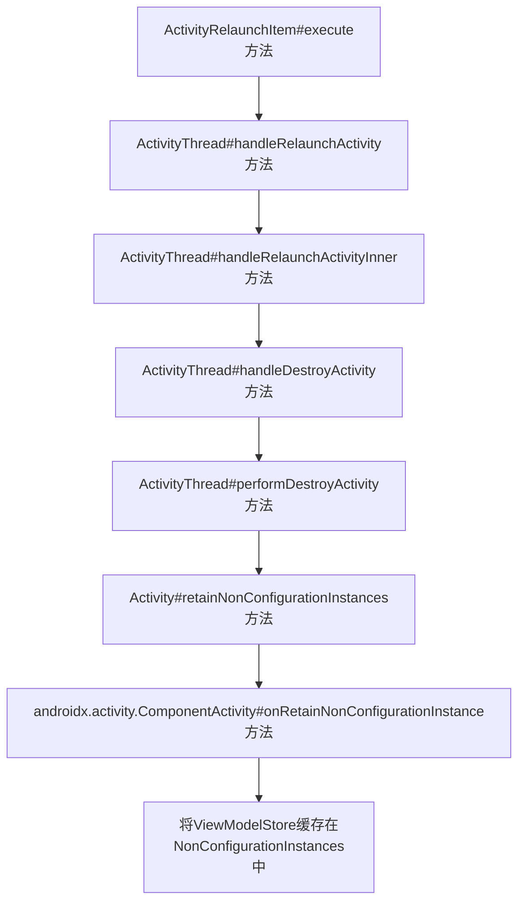
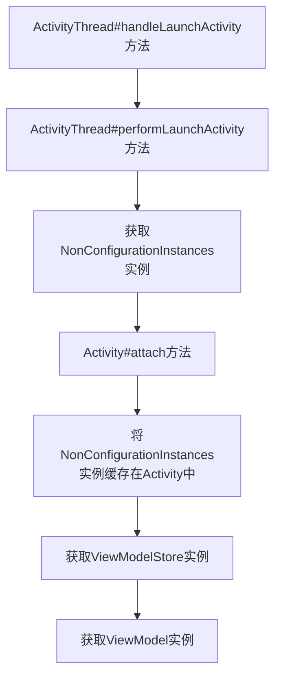

[TOC]

# Jetpack ViewModel源码分析

## ViewModel生命周期图


## 前提

- ViewModel：数据管理类。
- ViewModelProvider：用于创建管理ViewModel实例。
- ViewModelStore：用于存储ViewModel实例。
- ViewModelStoreOwner：是一个接口，用于获取ViewModelStore实例。
- Activity$NonConfigurationInstances：用于配置变更情况下缓存数据。


## 源码分析

### 创建ViewModel阶段

#### 基本流程


#### 创建ViewModelProvider实例

```java
public open class ViewModelProvider{
    @JvmOverloads
    constructor(
        private val store: ViewModelStore,
        private val factory: Factory,
        private val defaultCreationExtras: CreationExtras = CreationExtras.Empty,
    ) 

    public constructor(
        owner: ViewModelStoreOwner
    ) : this(owner.viewModelStore, defaultFactory(owner), defaultCreationExtras(owner))
}
```

#### 创建ViewModel实例

```kotlin
public open class ViewModelProvider {

    @MainThread
    public open operator fun <T : ViewModel> get(modelClass: Class<T>): T {
        val canonicalName = modelClass.canonicalName
        ?: throw IllegalArgumentException("Local and anonymous classes can not be ViewModels")
        // modelClass不为null，走get()方法
        // 使用类名拼接作为换成的key
        return get("$DEFAULT_KEY:$canonicalName", modelClass)
    }

    @MainThread
    public open operator fun <T : ViewModel> get(key: String, modelClass: Class<T>): T {
        // ViewModelStore通过key获取ViewModel对象
        val viewModel = store[key]
        // 如果有缓存，则直接返回ViewModel实例
        if (modelClass.isInstance(viewModel)) {
            (factory as? OnRequeryFactory)?.onRequery(viewModel)
            return viewModel as T
        } else {
            @Suppress("ControlFlowWithEmptyBody")
            if (viewModel != null) {
                // TODO: log a warning.
            }
        }
        val extras = MutableCreationExtras(defaultCreationExtras)
        extras[VIEW_MODEL_KEY] = key
        // 如果没有缓存，通过Factory创建ViewModel实例，然后存储在ViewModelStore中
        return try {
            factory.create(modelClass, extras)
        } catch (e: AbstractMethodError) {
            factory.create(modelClass)
        }.also { store.put(key, it) }
    }  
   
    public open class NewInstanceFactory : Factory {
        @Suppress("DocumentExceptions")
        override fun <T : ViewModel> create(modelClass: Class<T>): T {
            return try {
                // 通过class对象创建ViewModel实例
                modelClass.newInstance()
            } catch (e: InstantiationException) {
                throw RuntimeException("Cannot create an instance of $modelClass", e)
            } catch (e: IllegalAccessException) {
                throw RuntimeException("Cannot create an instance of $modelClass", e)
            }
        }

        public companion object {
            private var sInstance: NewInstanceFactory? = null 
            @JvmStatic
            public val instance: NewInstanceFactory
            @RestrictTo(RestrictTo.Scope.LIBRARY_GROUP)
            get() {
                if (sInstance == null) {
                    sInstance = NewInstanceFactory()
                }
                return sInstance!!
            }

            private object ViewModelKeyImpl : Key<String> 
            @JvmField
            val VIEW_MODEL_KEY: Key<String> = ViewModelKeyImpl
        }
    }
}
```

说明：

- ViewModelProvider类（ViewModel提供者），调用 get() 方法获取 ViewModel 实例。
- ViewModel 实例缓存在 ViewModelStore中，ViewModelProvider对象调用 get() 方法，首先从 ViewModelStore 中获取对象，如果有缓存则直接返回 ViewModel实例，如果没有缓存则通过Factory使用class对象创建 ViewModel 对象并缓存在 ViewModelStore中。

#### 获取ViewModelStore实例

```java
public class ComponentActivity extends androidx.core.app.ComponentActivity implements
    ViewModelStoreOwner { 

    // ViewModel存储容器
    private ViewModelStore mViewModelStore;

    // 创建ViewModelStore对象
    @Override
    public ViewModelStore getViewModelStore() {       
        ensureViewModelStore();
        return mViewModelStore;
    }

    // 创建ViewModelStore对象
    void ensureViewModelStore() {
        if (mViewModelStore == null) {
            NonConfigurationInstances nc =
                (NonConfigurationInstances) getLastNonConfigurationInstance();
            if (nc != null) {
                mViewModelStore = nc.viewModelStore;
            }
            if (mViewModelStore == null) {
                mViewModelStore = new ViewModelStore();
            }
        }
    }
}
```

```java
public class ViewModelStore {
    private final HashMap<String, ViewModel> mMap = new HashMap<>();

    public final void clear() {
        for (ViewModel vm : mMap.values()) {
            vm.clear();
        }
        mMap.clear();
    }
}
```

说明：

- ViewModelStore 是一个哈希表的数据结构。
- ComponentActivity 类实现了 ViewModelStoreOwner 接口实现了 getViewModelStore() 方法，在 Activity 创建会生成 ViewModelStore 对象。
- 当Activity旋转屏幕导致被销毁时，不仅会调用`onSaveInstanceState()`方法，还会调用`onRetainNonConfigurationInstance()`方法，屏幕旋转时保存ViewModelStore对象。

#### by viewModels()

```kotlin
@MainThread
public inline fun <reified VM : ViewModel> ComponentActivity.viewModels(
    noinline factoryProducer: (() -> Factory)? = null
): Lazy<VM> {
    val factoryPromise = factoryProducer ?: {
        defaultViewModelProviderFactory
    }
    return ViewModelLazy(VM::class, { viewModelStore }, factoryPromise)
}
```

```kotlin
public class ViewModelLazy<VM : ViewModel> (
    private val viewModelClass: KClass<VM>, //ViewModel的kClass对象，用于创建ViewModel实例
    private val storeProducer: () -> ViewModelStore, // ViewModelStore用于存储ViewModel
    private val factoryProducer: () -> ViewModelProvider.Factory // 用于创建ViewModel实例的工厂
) : Lazy<VM> {
    private var cached: VM? = null

    override val value: VM
        get() {
            val viewModel = cached
            return if (viewModel == null) {
                val factory = factoryProducer()
                val store = storeProducer()
                // 最终通过ViewModelProvider创建ViewModel
                ViewModelProvider(store, factory).get(viewModelClass.java).also {
                    cached = it
                }
            } else {
                viewModel
            }
        }

    override fun isInitialized(): Boolean = cached != null
}
```

说明：

by viewModels() 最终会调用 ViewModelProvider(owner).get(modelClass) 。

#### 销毁ViewModel

```java
public class ComponentActivity extends androidx.core.app.ComponentActivity implements
        ContextAware,
    LifecycleOwner,
    ViewModelStoreOwner,
    HasDefaultViewModelProviderFactory,
    SavedStateRegistryOwner,
    OnBackPressedDispatcherOwner,
    ActivityResultRegistryOwner,
    ActivityResultCaller {

    public ComponentActivity() {
        getLifecycle().addObserver(new LifecycleEventObserver() {
            @Override
            public void onStateChanged(@NonNull LifecycleOwner source,
                                       @NonNull Lifecycle.Event event) {
                if (event == Lifecycle.Event.ON_DESTROY) {
                    // 当Activity销毁时，先判断是否由于配置变更导致，如果不是则清空ViewModelStore
                    mContextAwareHelper.clearAvailableContext();
                    // And clear the ViewModelStore
                    if (!isChangingConfigurations()) {
                        getViewModelStore().clear();
                    }
                }
            }
        });
    }
}
```

说明：在 Activity 销毁时，ViewModelStore 会调用 clear() 方法清空哈希表。


### 缓存ViewModel阶段

#### 基本流程



#### ActivityRelaunchItem#execute()

```java
public class ActivityRelaunchItem extends ActivityTransactionItem {

    @Override
    public void execute(ClientTransactionHandler client, ActivityClientRecord r,
            PendingTransactionActions pendingActions) {
        if (mActivityClientRecord == null) {
            if (DEBUG_ORDER) Slog.d(TAG, "Activity relaunch cancelled");
            return;
        }
        Trace.traceBegin(Trace.TRACE_TAG_ACTIVITY_MANAGER, "activityRestart");
        // 调用ActivityThread#handleRelaunchActivity()
        client.handleRelaunchActivity(mActivityClientRecord, pendingActions);
        Trace.traceEnd(Trace.TRACE_TAG_ACTIVITY_MANAGER);
    }
}
```

说明：当 Activity 由于配置变更而导致销毁时，Android 系统会使用 ActivityRelaunchItem 来执行重启行为。

#### ActivityThread#handleRelaunchActivity()

```java
public void handleRelaunchActivity(ActivityClientRecord tmp,
                                   PendingTransactionActions pendingActions) {
    ActivityClientRecord r = mActivities.get(tmp.token);
    r.activity.mConfigChangeFlags |= configChanges;
    r.mPreserveWindow = tmp.mPreserveWindow;
    r.activity.mChangingConfigurations = true;

    // 调用ActivityThread#handleRelaunchActivity()
    handleRelaunchActivityInner(r, configChanges, tmp.pendingResults, tmp.pendingIntents,
                                pendingActions, tmp.startsNotResumed, tmp.overrideConfig, "handleRelaunchActivity");
}
```

#### ActivityThread#handleRelaunchActivityInner()

```java
private void handleRelaunchActivityInner(ActivityClientRecord r, int configChanges, List<ResultInfo> pendingResults, List<ReferrerIntent> pendingIntents, PendingTransactionActions pendingActions, boolean startsNotResumed, Configuration overrideConfig, String reason) {
    // 回调Activity#onPause()
    performPauseActivity(r, false, reason, null);
    // 回调Activity#onStop()
    callActivityOnStop(r, true, reason);
    // 调用ActivityThread#handleDestroyActivity()
    handleDestroyActivity(r, false, configChanges, true, reason);
    // 启动Activity
    handleLaunchActivity(r, pendingActions, customIntent);
}
```

#### ActivityThread#handleDestroyActivity()

```java
public void handleDestroyActivity(ActivityClientRecord r, boolean finishing, int configChanges,
                                  boolean getNonConfigInstance, String reason) {
    // 调用ActivityThread#performDestroyActivity()
    performDestroyActivity(r, finishing, configChanges, getNonConfigInstance, reason);
}
```

#### ActivityThread#performDestroyActivity()
```java
void performDestroyActivity(ActivityClientRecord r, boolean finishing,
                            int configChanges, boolean getNonConfigInstance, String reason) {

    if (getNonConfigInstance) {
        try {
            // 调用Activity#retainNonConfigurationInstances()
            // 获取NonConfigurationInstances对象并存放在ActivityClientRecord中
            r.lastNonConfigurationInstances = r.activity.retainNonConfigurationInstances();
        } 
    }
    // 回调Activity#onDestroy()
    mInstrumentation.callActivityOnDestroy(r.activity);
}
```

#### ActivityClientRecord类

在 Android 的 Activity 生命周期管理和任务调度中，`ActivityClientRecord` 是一个非常重要的内部类，它在 `ActivityThread` 中用于跟踪和管理 Activity 的状态。`ActivityClientRecord` 作为 Activity 的代理，封装了与 Activity 相关的所有信息和状态。

#### Activity#retainNonConfigurationInstances()

```java
NonConfigurationInstances retainNonConfigurationInstances() {
    Object activity = onRetainNonConfigurationInstance();
    // 最终回调ComponentActivity#onRetainNonConfigurationInstance()
    HashMap<String, Object> children = onRetainNonConfigurationChildInstances();
  	// 创建NonConfigurationInstances实例
    NonConfigurationInstances nci = new NonConfigurationInstances();
    nci.activity = activity;
    nci.children = children;
    nci.fragments = fragments;
    nci.loaders = loaders;
    if (mVoiceInteractor != null) {
        mVoiceInteractor.retainInstance();
        nci.voiceInteractor = mVoiceInteractor;
    }
    // 返回NonConfigurationInstances对象
    return nci;
}

// 此方法交给子Activity实现
public Object onRetainNonConfigurationInstance() {
    return null;
}
```

#### Activity$NonConfigurationInstances类

```java
static final class NonConfigurationInstances {
    Object activity;
    HashMap<String, Object> children;
    FragmentManagerNonConfig fragments;
    ArrayMap<String, LoaderManager> loaders;
    VoiceInteractor voiceInteractor;
}
```

说明：NonConfigurationInstances其实就是一个Wrapper，用来包装一下因为不受配置更改影响的数据，包括我们非常熟悉的Fragment，比如说，一个Activity上面有一个Fragment，旋转了屏幕导致Activity重新创建，此时Activity跟之前的不是同一个对象，但是Fragment却是同一个，这就是通过NonConfigurationInstances实现的。

#### androidx.activity.ComponentActivity#onRetainNonConfigurationInstance()

```java
public final Object onRetainNonConfigurationInstance() {
    // 获取Activity的ViewModelStore
    ViewModelStore viewModelStore = mViewModelStore;
    // 如果ViewModelStore为null，则从NonConfigurationInstances中获取ViewModelStore对象
    if (viewModelStore == null) {
        NonConfigurationInstances nc =
            (NonConfigurationInstances) getLastNonConfigurationInstance();
        if (nc != null) {
            viewModelStore = nc.viewModelStore;
        }
    }

    if (viewModelStore == null && custom == null) {
        return null;
    }

    // 如果ViewModelStore不为null，则将ViewModelStore缓存在NonConfigurationInstances中。
    NonConfigurationInstances nci = new NonConfigurationInstances();
    nci.custom = custom;
    nci.viewModelStore = viewModelStore;
    return nci;
}
```

说明：ComponentActivity$NonConfigurationInstances 对象会缓存 ViewModelStore 对象，Activity$NonConfigurationInstances 对象会缓存 ComponentActivity$NonConfigurationInstances 对象。

#### ComponentActivity$NonConfigurationInstances类

```java
static final class NonConfigurationInstances {
    Object custom;
    ViewModelStore viewModelStore;
}
```


### 恢复ViewModel阶段

#### 基本流程



#### ActivityThread#handleLaunchActivity()

```java
public Activity handleLaunchActivity(ActivityClientRecord r,
                                     PendingTransactionActions pendingActions, 
                                     Intent customIntent) {
	// 调用ActivityThread#performLaunchActivity()
    final Activity a = performLaunchActivity(r, customIntent);
    return a;
}
```

#### ActivityThread#performLaunchActivity()

```java
private Activity performLaunchActivity(ActivityClientRecord r, Intent customIntent) {
    //创建新的Activity    
    Activity activity = mInstrumentation.newActivity(cl, component.getClassName(), r.intent);
    //创建火获取Application实例
    Application app = r.packageInfo.makeApplication(false, mInstrumentation);
    // 调用Activity#attach()
    // 从ActivityClientRecord中获取NonConfigurationInstances对象，传递到attach()
    activity.attach(appContext, this, getInstrumentation(), r.token,
                    r.ident, app, r.intent, r.activityInfo, title, r.parent,
                    r.embeddedID, r.lastNonConfigurationInstances, config,
                    r.referrer, r.voiceInteractor, window, r.configCallback,
                    r.assistToken, r.shareableActivityToken);
    //清空缓存
    r.lastNonConfigurationInstances = null;
    return activity;
}
```

#### Activity#attach()

```java
final void attach(Context context, ActivityThread aThread,
                  Instrumentation instr, IBinder token, int ident,
                  Application application, Intent intent, ActivityInfo info,
                  CharSequence title, Activity parent, String id,
                  NonConfigurationInstances lastNonConfigurationInstances,
                  Configuration config, String referrer, IVoiceInteractor voiceInteractor,
                  Window window, ActivityConfigCallback activityConfigCallback, IBinder 	          assistToken,
                  IBinder shareableActivityToken) {
    	// 重新缓存NonConfigurationInstances实例
        mLastNonConfigurationInstances = lastNonConfigurationInstances;
}
```

#### ComponentActivity#getViewModelStore()

获取ViewModelStore。

```java
public ViewModelStore getViewModelStore() {
    if (getApplication() == null) {
        throw new IllegalStateException("Your activity is not yet attached to the "
                + "Application instance. You can't request ViewModel before onCreate call.");
    }
    ensureViewModelStore();
    return mViewModelStore;
}

void ensureViewModelStore() {
    if (mViewModelStore == null) {
        NonConfigurationInstances nc =
                (NonConfigurationInstances) getLastNonConfigurationInstance();
        if (nc != null) {
            // 从NonConfigurationInstances对象中获取ViewModelStore实例
            mViewModelStore = nc.viewModelStore;
        }
        if (mViewModelStore == null) {
            mViewModelStore = new ViewModelStore();
        }
    }
}
```


## 总结

- 创建ViewModel阶段：通过 by viewModels() 创建 ViewModel 实例，本质是调用 ViewModelProvider(this).get(MyViewModel::class.java)，会先尝试从 ViewModelStore 中获取，ViewModelStore 是一个哈希表的数据结构，如果没有则新建并缓存在 ViewModelStore，ViewModelStore 是ComponentActivity中的一个属性。
- 缓存ViewModel阶段：在配置变更情况下，ViewModelStore 会被缓存在 NonconfigurationInstances 中。
- 恢复ViewModel阶段：配置变更后会重启 Activity，会先从 NonconfigurationInstances  中读取 ViewModelStore，接着获取 ViewModel 实例。
- Activity 正常销毁时会清空 ViewModelStore。

